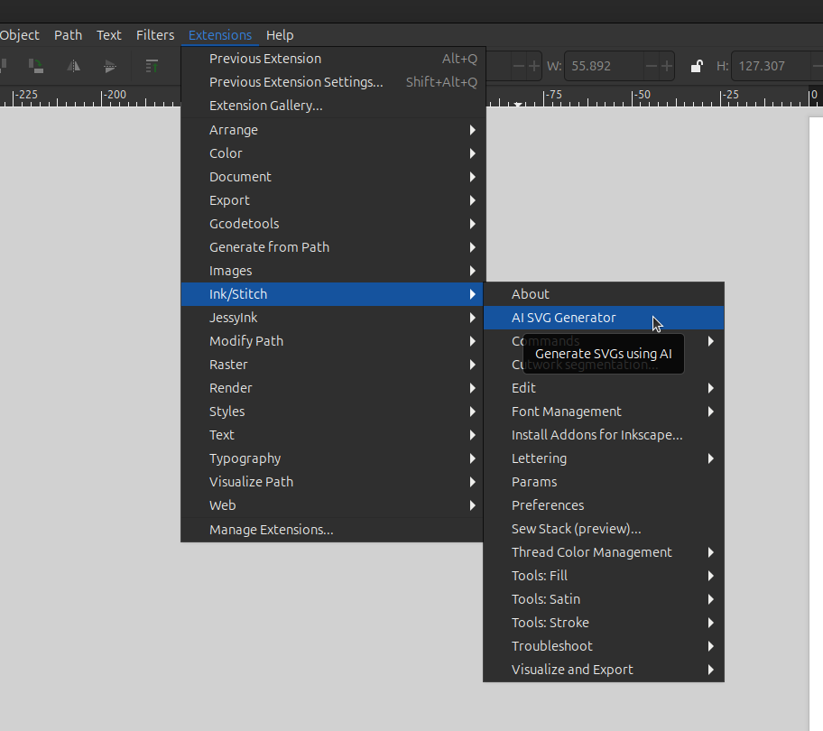
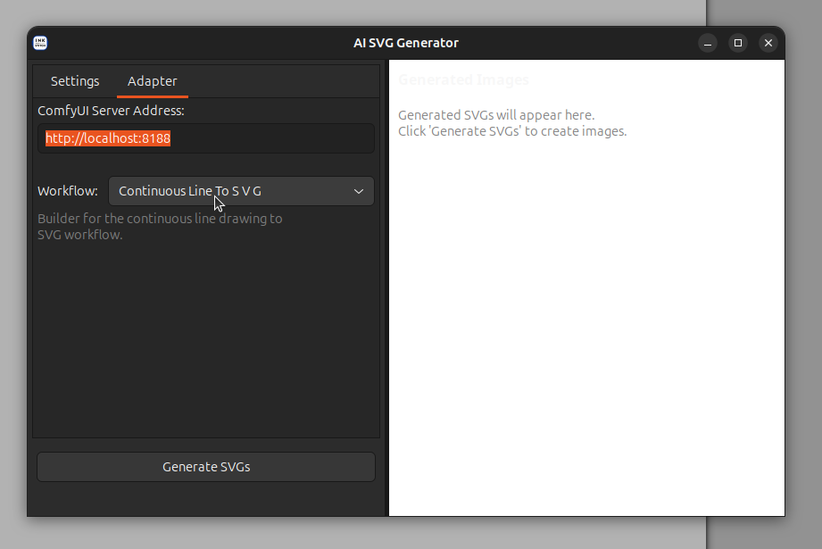
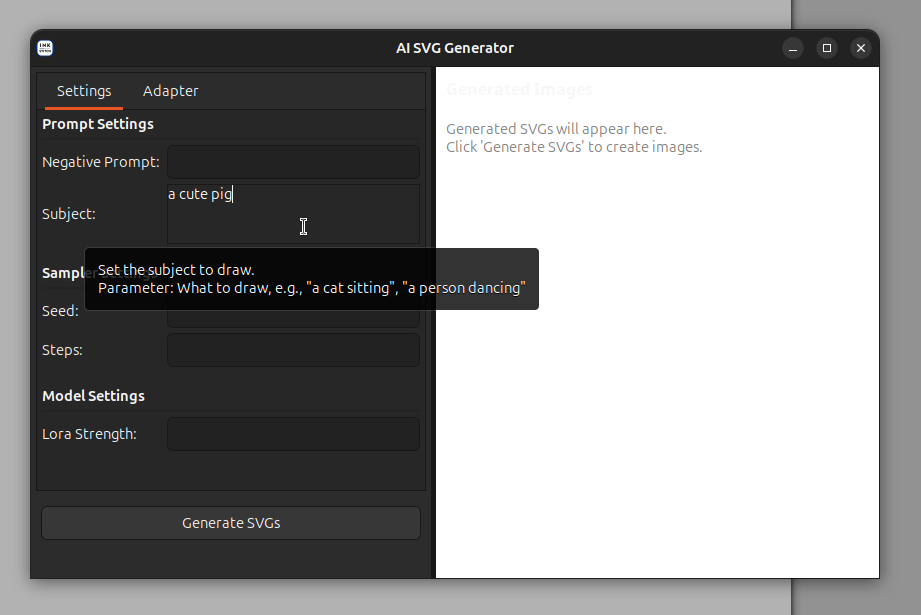
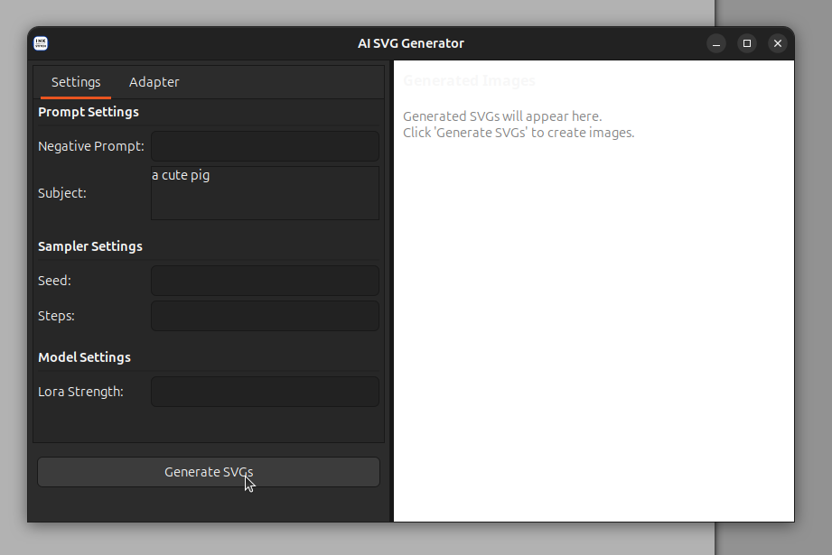
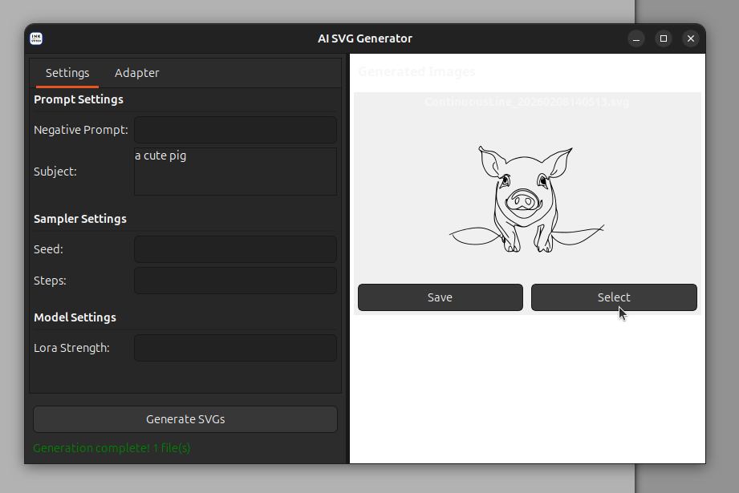

# AI SVG Generator — User Guide

Generate embroidery-ready SVG designs using AI, directly from within Inkscape.

---

## Prerequisites

1. **Inkscape 1.4+** with the Ink/Stitch extension installed.
2. **A running ComfyUI server** — see [ComfyUI Setup](02-comfyui-setup.md).

---

## Opening the Extension

1. Launch **Inkscape**.
2. Open the menu **Extensions → Ink/Stitch → AI SVG Generator**.

The AI SVG Generator window opens as a separate dialog.

---

## Step 1 — Configure the Adapter

Switch to the **Adapter** tab at the top of the left panel.

### ComfyUI Server Address

Enter the URL of your ComfyUI instance. The default is `http://localhost:8188`.
If ComfyUI is running on another machine use its IP/hostname instead.

### Workflow Selection

Pick a workflow from the dropdown. Each workflow is a different generation
pipeline — for example:

| Workflow | Description |
|---|---|
| Continuous Line to SVG | Generates a single continuous-line drawing and traces it to SVG |
| Logo to SVG | Generates a logo-style graphic and traces it to SVG |

A short description of the selected workflow appears below the dropdown.

---

## Step 2 — Adjust Settings

Switch to the **Settings** tab. The controls here are **generated dynamically**
based on the selected workflow — different workflows may show different options.

Settings are grouped by category:

### Prompt Settings

| Setting | What it does |
|---|---|
| **Subject** | Describe what you want to generate (e.g. "a cat sitting", "a rose") |
| **Negative Prompt** | Describe what the AI should *avoid* (e.g. "blurry, low quality") |

### Sampler Settings

| Setting | What it does |
|---|---|
| **Steps** | More steps = higher quality but slower. 20–40 is a good range. |
| **Lora Strength** | How strongly the style model influences the result (0.0–2.0). |

> **Tip:** Hover over any control to see a tooltip explaining what it does and
> how it affects the output.

---

## Step 3 — Generate

Click the **Generate SVGs** button at the bottom of the left panel.

The status bar below the button shows progress:

1. *Building workflow…*
2. *Sending to ComfyUI…*
3. *Generation complete! N file(s)* (green) — or an error message (red).

---

## Step 4 — Review & Save Results

Generated images appear in the **Preview** panel on the right. Each result
shows a thumbnail and two buttons:

| Button | Action |
|---|---|
| **Save** | Save the file to disk (SVG or PNG depending on the output) |
| **Select** | Insert the SVG directly into your current Inkscape document as a new group in the active layer |

---

## Step 5 — Insert into Your Document

When you click **Select**:

- The SVG paths are imported into the **currently active Inkscape layer**.
- They are placed inside a group labelled *AI Generated SVG*.
- You can then move, scale, or apply embroidery parameters to the group just
  like any other Ink/Stitch object.

---

## Troubleshooting

| Problem | Solution |
|---|---|
| *"Connection refused"* or timeout | Check that ComfyUI is running and the URL in the Adapter tab is correct. |
| *"No output files found"* | Open `~/ai_svg_debug.log` for details. Usually means a ComfyUI node failed — check the ComfyUI terminal output. |
| Generated image is blank or garbled | The required models may be missing. Check ComfyUI's console for errors. |
| Extension does not appear in Inkscape | INX files may not be generated. Run `make inx` and restart Inkscape (see developer docs). |

---

## Next Steps

- [ComfyUI Setup](02-comfyui-setup.md) — installing, configuring, and running ComfyUI for use with this extension.

